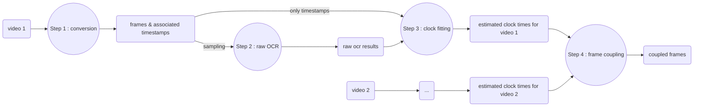

# Frame-Coupler

## Short description

This program selects common images from a set of videos, using the display of a digital clock in the field of view to synchronize their times.

## Long description

This program is used to find common frames between two or more videos. To use it, you need to display a digital clock in the field of view of both videos. This digital clock will be read digitally and will be used to have a precise date associated to every image of the videos. This allows to film something with different devices, different start and end times for the video, different frame rates, etc. and get common frames between this videos anyway.

This common frames are not evenly spaced throughout time. For a set of two videos if the frame rates of the devices are close but not exactly the same, there will be a 'beating' phenomenon. If the frame rates are not consistent, the spacing between common frames will feel random.

This is especially useful as it is often hard to synchronize the start of videos filmed using two or more different devices ; furthermore, depending on the device, the frame rate can be inconsistent and there could be frames missing. 

This digital clock can have a refresh rate that is under the one of the cameras filming it as the fitting will allow to discriminate the frames anyway.

These videos should be MPEG-4 files, which will be converted to gray JPEG frames. Each frame of a MPEG-4 file is associated with a time stamp.

The digital clock is supposed to be of this model : https://www.youtube.com/watch?v=rf2Lmfqi5ZM

## Releases

You can find executable files generated with cx_Freeze in the 'releases' tab.

## Work flow

Here is a flowchart to understand how it works :

The process is divided into 4 steps. These steps can be executed independently using their own python files, or the full process can be executed in one shot using the _main.py_ file.

- step 1 : the MPEG-4 (.mp4) video is converted into gray JPEG (.jpg) frames and a pickle file containing the timestamps of each frame.
  - .png would probably be better than .jpg, however _tesseract_ seems to prefer .jpg files.
  - each extractable frame is saved.
  
- step 2 : OCR (Optical Character Recognition) is performed on some of theses frames. The user chooses a zone were we should find the digital clock. The _tesseract_ API _pytesseract_ is then used to try and read this clock. The raw results of this process are saved in a _python pickle_ file in the folder of the frames.
- step 3 : The raw results of the preceding step are processed to clean OCR errors and get a date in milliseconds (for example, 00:01:3@:I33 is transformed to 00:01:30:133 and then transformed to 90133 milliseconds). This milliseconds readings are then used to fit a linear curve using the timestamps of the frames. After this step, we have associated a date in milliseconds to every frame using their (even those were we couldn't read the digital clock). The results of this process are saved in another _python pickle_ file in the folder of the frames.
- step 4 : This last step can be done when steps 1 to 3 were done to at least 2 videos. During this last steps, the dates in milliseconds associated to every frames are read to find common frames between the two videos. A frame is deemed 'common' to both videos when the difference of their dates is under a certain threshold. The results of this process is the coupled frames in different folders and a .csv file containing the dates.

## How to install the program

The program was tested and coded using _python 3.10_. Any equal or superior version _python_ install should work fine.

You can use 'verify_librairies.py' to see which imports are missing and if your install went well.

You should install _Tesseract-OCR_ from _Google_ as a program (https://github.com/tesseract-ocr) to use the _pytesseract_ library. You can find setup programs here : https://tesseract-ocr.github.io/tessdoc/Installation.html. You should then find the executable file of _Tesseract_ (generally found at 'C:\Program Files\Tesseract-OCR\tesseract.exe') and copy its path to the variable 'pytesseract_exe_file_path' in the 'run_parameters.py' file.

Third-Party _python_ librairies that you also need to install : 

- numpy (all steps)
- matplotlib.pyplot (all steps)
- cv2 (step1)
- PIL (step1, step2)
- pytesseract (step2)

## How to run them program

The file 'run_parameters.py' contains variables that you should change to match your needs and your installation of _pytesseract_, especially the _Tesseract_ executable path, but also :

- 'info_level' : How much the user should be informed of the inner workings of the programs during runtime.
- 'save' : Should the coupled images be saved to a separate folder.

A more complete description of these values can be found directly as comments in the 'run_parameters.py' file.

The program can be used in two ways, depending on which file is the ran as the main file.

- Using 'main.py' to do all the steps at once (easier to use but fallible) ; you just need to follow the prompts of the program. This is meant to be almost entirely command-line (except choosing the cropping for the OCR).
- Using each step individually to control more the results. Using these individual steps, there is more dialogs and user interfaces. You can also go back easily when you are not happy with the results of one of the steps.

## License

Shield: [![CC BY-NC-SA 4.0][cc-by-nc-sa-shield]][cc-by-nc-sa]

This work is licensed under a
[Creative Commons Attribution-NonCommercial-ShareAlike 4.0 International License][cc-by-nc-sa].

[![CC BY-NC-SA 4.0][cc-by-nc-sa-image]][cc-by-nc-sa]

[cc-by-nc-sa]: http://creativecommons.org/licenses/by-nc-sa/4.0/
[cc-by-nc-sa-image]: https://licensebuttons.net/l/by-nc-sa/4.0/88x31.png
[cc-by-nc-sa-shield]: https://img.shields.io/badge/License-CC%20BY--NC--SA%204.0-lightgrey.svg
