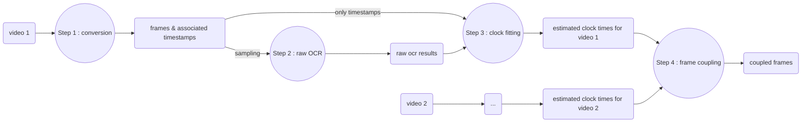

# Frame-Coupler

This little program selects common images from a set of videos, using the display of a digital clock in the field of view.

These videos should be MPEG-4 files, which will be converted to gray JPEG frames.

The digital clock is supposed to be of this model : https://www.youtube.com/watch?v=rf2Lmfqi5ZM

It uses Tesseract for the OCR https://github.com/tesseract-ocr

You can use 'verify_librairies.py' to see which imports are missing.

The file 'run_parameters.py' contains variables that you should change to match your needs and your installation of pytesseract.

# Work Flow

